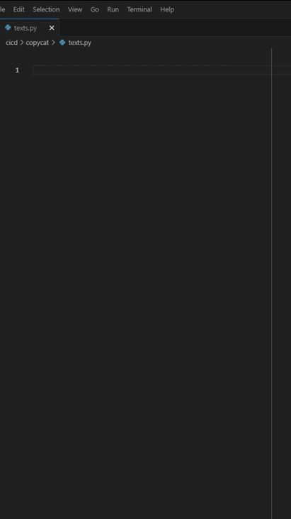

# UPBGE Utilities

[wiki](https://github.com/MRCardoso/upbge-utils/wiki)

|**Version**|**Detail**|
|---|---|
|**[2.1.0](https://github.com/MRCardoso/upbge-utils/releases/tag/2.1.0)**|Features - added addon/component_worker - create cicd folder for python scripts - cicd/translate - cicd/cloud-files - cicd/image-processor - cicd/video-processor|
|**[2.0.0](https://github.com/MRCardoso/upbge-utils/releases/tag/2.0.0)**|Features - addon/release_game auto fill from txt|
|**[1.1.0](https://github.com/MRCardoso/upbge-utils/releases/tag/1.1.0)**|Features - addon/release_game add upbge path|
|**[1.0.3](https://github.com/MRCardoso/upbge-utils/releases/tag/1.0.3)**|Fix bug into addon/steam_worker load after install|
|**[1.0.2](https://github.com/MRCardoso/upbge-utils/releases/tag/1.0.2)**|Fix bug into addon/release_game resize image, and imports log|
|**[1.0.1](https://github.com/MRCardoso/upbge-utils/releases/tag/1.0.1)**|Fix bug into addon/release_game.py|
|**[1.0.0](https://github.com/MRCardoso/upbge-utils/releases/tag/1.0.0)**|Startup project|

## Addons
<table>
    <thead>
        <tr>
            <td>Release Game</td>
            <td>Steamworks</td>
        </tr>
    </thead>
    <tbody>
        <tr>
            <td></td>
            <td></td>
        </tr>
    </tbody>
</table>

## Scripts

<table>
    <thead>
        <tr>
            <td>Gif Generator</td>
            <td>Translate</td>
        </tr>
    </thead>
    <tbody>
        <tr>
            <td></td>
            <td></td>
        </tr>
        <tr>
            <td>Image processor</td>
            <td>Upload File</td>
        </tr>
        <tr>
            <td></td>
            <td></td>
        </tr>
    </tbody>
</table>