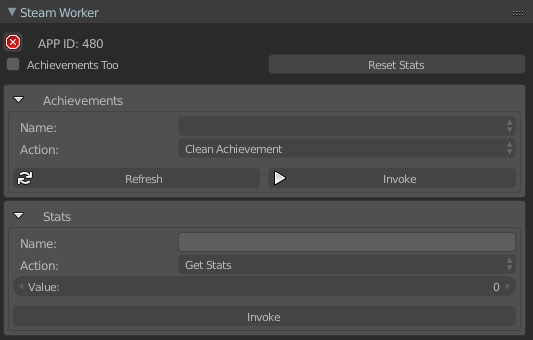

# UPBGE Utilities

[wiki](https://github.com/MRCardoso/upbge-utils/wiki)

|**Version**|**Detail**|
|---|---|
|**[1.0.3](https://github.com/MRCardoso/upbge-utils/releases/tag/1.1.0)**|Feature into addon/release_game add upbge path|
|**[1.0.3](https://github.com/MRCardoso/upbge-utils/releases/tag/1.0.3)**|Fix bug into addon/steam_worker load after install|
|**[1.0.2](https://github.com/MRCardoso/upbge-utils/releases/tag/1.0.2)**|Fix bug into addon/release_game resize image, and imports log|
|**[1.0.1](https://github.com/MRCardoso/upbge-utils/releases/tag/1.0.1)**|Fix bug into addon/release_game.py|
|**[1.0.0](https://github.com/MRCardoso/upbge-utils/releases/tag/1.0.0)** |Startup project|

## Release Game

## Steamworks

