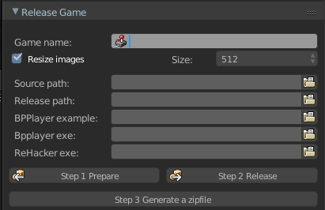
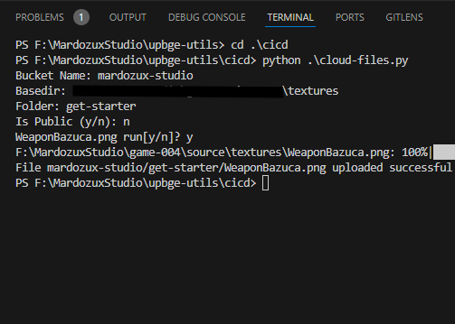

# UPBGE Utilities

[wiki](https://github.com/MRCardoso/upbge-utils/wiki)

|**Version**|**Detail**|
|---|---|
|**[2.1.0](https://github.com/MRCardoso/upbge-utils/releases/tag/2.1.0)**|Features added addon/component_worker create cicd folder for python scripts|
|**[2.0.0](https://github.com/MRCardoso/upbge-utils/releases/tag/2.0.0)**|Features added addon/release_game auto fill from txt|
|**[1.1.0](https://github.com/MRCardoso/upbge-utils/releases/tag/1.1.0)**|Features  addon/release_game add upbge path|
|**[1.0.3](https://github.com/MRCardoso/upbge-utils/releases/tag/1.0.3)**|Fix bug into addon/steam_worker load after install|
|**[1.0.2](https://github.com/MRCardoso/upbge-utils/releases/tag/1.0.2)**|Fix bug into addon/release_game resize image, and imports log|
|**[1.0.1](https://github.com/MRCardoso/upbge-utils/releases/tag/1.0.1)**|Fix bug into addon/release_game.py|
|**[1.0.0](https://github.com/MRCardoso/upbge-utils/releases/tag/1.0.0)**|Startup project|

## Addons

### Release Game

### Steamworks

## Scripts

### Gif Generator

### Translate

### Image processor

### Upload File
