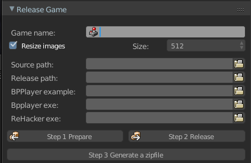
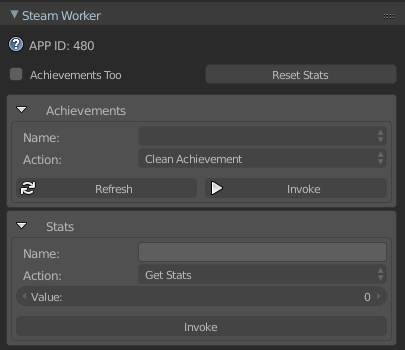

# Custom Addons 

## Release Game
###### File: **release_game.py**

> :warning: **[BPPlayer](https://blenderartists.org/t/bpplayer/1126605/7)** is required to export the game

Addon to export game using BPPlayer and ResourceHacker

### Props:
* **Game name:** (String) Name of the game
* **Resize images:** (Bool) Reside images in prepare build
* **Size:** (Enum[254, 512, 1024]) Available dimensions to resize texture/images
* **Source path:** (String) Path of your .blend project
* **Release path:** (String) Path of your game exported and .exe
* **BPPlayer example:** (String) Path to BPPlayer.exe
* **Bpplayer exe:** (String) Path to BPPlayerGUI.exe
* **ReHacker exe:** (String) Path to ResourceHacker.exe

### Buttons
* **Step 1 Prepare**
    - import external python scripts inside .blend
    - If *`Resize images`* True Resize images

* **Step 2 Release**
    - Remove old *`Release path/Game name`* folder
    - Import files from UPBGE engine into *`Release path/Game name`*
    - Copy from UPBGE **steam_appid.txt** if exists
    - If *`Source path`* is set copy **readme** and **storage/*** (if exists) into *`Release path/Game name`*
    - Move the *`BPBPPlayer example`* into *`Release path/Game name/Game name.exe`*
    - Open *`Bpplayer exe`* to export game
    - If *`ReHacker exe`* is set open ResourceHacker to change icon

* **Step 3 Generate a zipfile**
    - Remove old *`Release path/Game name.zip`*
    - Generate new *`Release path/Game name.zip`*

## Steam Worker
##### File: steam_worker.py

> :warning: **[SteamworksPy](https://github.com/philippj/SteamworksPy/archive/refs/tags/1.6.5.zip)** and **[Steamworks Sdk](https://partner.steamgames.com/downloads/steamworks_sdk_157.zip)** are required

`UPBGE-folder requires below files`
- **steam must be running**
- **SteamworksPy64.dll** from `SteamworksPy/VERSION/redist/windows`
- **steam_api64.dll** from `Steamworks/sdk/redistributable_bin/win64`
- **steam_api64.lib** from `Steamworks/sdk/redistributable_bin/win64`
- **steam_appid.txt** Create this file with steam [APPID](https://partner.steamgames.com/doc/features/achievements/ach_guide)
- **steamworks/\*** from `SteamworksPy/VERSION`
    - **Global** copy into `UPBGE-folder/2.79/python/lib/`
    - **Loca** copy into `yourgame/`

Addon to test achievements and stats for steam with lib (steamworkPy)

### Reset all:
* **Achievements Too:** (Bool) reset achievements too
* **Reset Stats:** (Button) reset all statistics

### Achievements:
* **Name:** (Enum) List of Achievements
* **Action:** (Enum[set,get,clean]) List of actions to process the achievement
* **Refresh:** (Button) Refresh List of Achievements
* **Invoke:** (Button) Run the Action selected by the achievement Name

### Stats:
* **Name:** (String) Name of the statistic
* **Action:** (Enum[set,get]) List of actions to process the statistic
* **Value:** (Int) value to save into Action set
* **Invoke:** (Button) Run the Action selected by the statistic Name